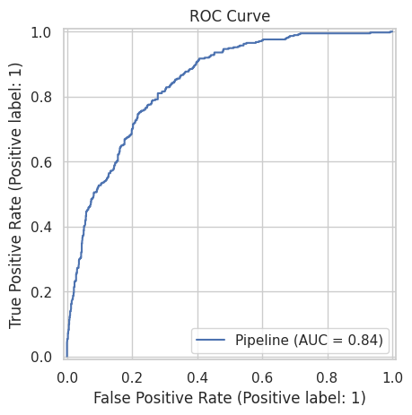
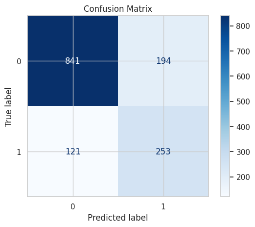
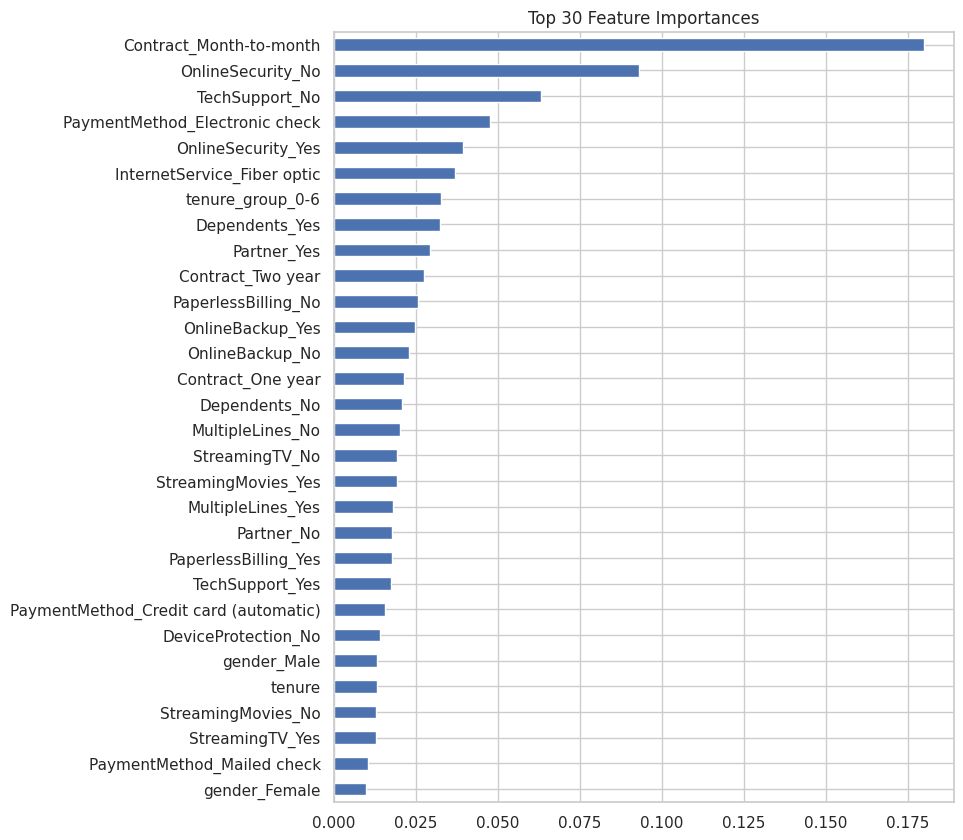
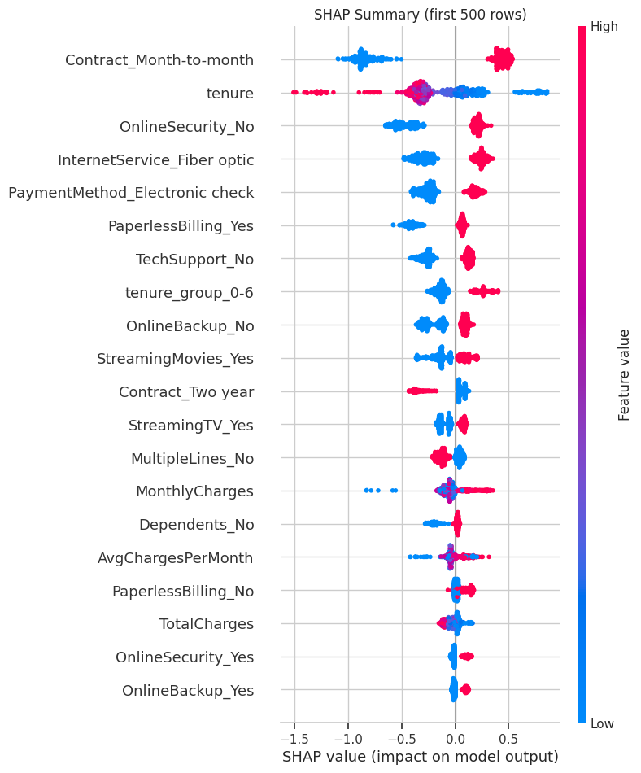

# Customer Churn Prediction

This project focuses on predicting customer churn for a telecom company using machine learning. Churn prediction allows businesses to identify customers who are likely to stop using their services and take proactive steps to retain them.

---

## Project Overview

Customer churn is a critical challenge in subscription-based businesses. Using historical customer data (demographics, account information, and service usage), we trained a classification model to predict whether a customer will churn.

The project includes:

* Data preprocessing and feature engineering
* Model training and evaluation
* Model interpretation using SHAP values and feature importance
* Visualization of model performance

---

## Repository Structure

```
customer-churn/
├── data/                      # Dataset files
├── models/
│   └── best_churn_model.pkl   # Saved trained model
├── notebooks/                 # Jupyter/Colab notebooks
├── images/                    # Generated plots and figures
│   ├── shap_summary.png
│   ├── feature_importance.png
│   ├── roc_curve.png
│   └── confusion_matrix.png
├── README.md                  # Project documentation
└── requirements.txt           # Dependencies
```

---

## Results & Interpretation

### 1️⃣ Model Performance

**Classification Report**

```
precision    recall  f1-score   support

0   0.8742    0.8126    0.8423    1035
1   0.5660    0.6765    0.6163     374

accuracy     0.7764
macro avg    0.7201    0.7445    0.7293
weighted avg 0.7924    0.7764    0.7823
```

* The model achieves **77.6% accuracy** and an **AUC of 0.84**.
* Class **0** (No Churn) has higher precision and recall than Class **1** (Churn), indicating the model is slightly better at identifying customers who will stay.

---

### 2️⃣ ROC Curve



* **AUC = 0.84** indicates strong discriminative ability between churn and non-churn customers.

---

### 3️⃣ Confusion Matrix



* **True Negatives (841)**: Correctly predicted non-churn customers.
* **True Positives (253)**: Correctly predicted churn customers.
* **False Positives (194)**: Predicted churn but actually stayed.
* **False Negatives (121)**: Predicted stay but actually churned.

---

### 4️⃣ Feature Importance



* The most important factors influencing churn are:

  1. **Contract Type (Month-to-Month)** – Customers without long-term contracts are more likely to churn.
  2. **Lack of Online Security** – Customers without this service tend to leave.
  3. **Lack of Tech Support** – Increases churn likelihood.
  4. **Electronic Check Payment Method** – Correlates with higher churn.
  5. **Fiber Optic Internet Service** – Surprisingly, associated with higher churn compared to DSL.

---

### 5️⃣ SHAP Summary



* **Contract Type** strongly impacts churn prediction—short-term contracts increase churn risk.
* **Tenure**: Shorter tenure customers have higher churn probability.
* **Lack of Support Services** (Online Security, Tech Support, Online Backup) is a strong churn driver.

---

## 🚀 How to Run the Project

1. **Clone the repository**

   ```bash
   git clone https://github.com/yourusername/customer-churn.git
   cd customer-churn
   ```

2. **Install dependencies**

   ```bash
   pip install -r requirements.txt
   ```

3. **Run the notebook**
   Open the notebook in Jupyter or Google Colab to explore data and train the model.

4. **Load the trained model**

   ```python
   import joblib
   model = joblib.load('models/best_churn_model.pkl')
   ```

---

## Key Insights

* Customers with **short-term contracts**, **low tenure**, and **no additional security/backup services** are most at risk.
* Improving **customer engagement** early in their lifecycle can reduce churn.
* Offering **bundled security & support services** may increase retention.
* Targeted campaigns can be designed for customers paying via **electronic check** to encourage alternative payment methods.
